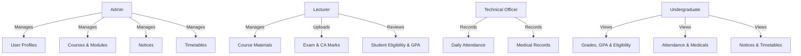

# Faculty Management System (FMS)

**Repository:** https://github.com/mohamedrazim11-maker/OOPP-2026-GP-10.git  
**Active Branch:** Rashkan

**University of Ruhuna — Faculty of Technology**  
**Bachelor of Information and Communication Technology (BICT) Degree**  
**Course Unit:** ICT2132 – Object Oriented Programming Practicum  
**Academic Level:** Level II (Semester I) – Mini Project

---

## 📌 Project Overview

The **Faculty Management System (FMS)** is a desktop-based application developed using **Java** and **MySQL** tailored for the Faculty of Technology, University of Ruhuna. The system streamlines academic administration and operations by managing user profiles, course modules, attendance tracking, medical submissions, continuous assessment (CA) and final examination marks, eligibility calculations, grading (under UGC guidelines), timetables, and notice boards.

---

## 👥 User Roles & Key Responsibilities



### 1. 🛡️ Administrator

- **User Management**: Create and maintain all system user profiles (Admin, Lecturer, Technical Officer, Undergraduate).
- **Course Management**: Add, update, and manage course modules and credit allocations.
- **Timetable Management**: Create and maintain departmental lecture and practical timetables.
- **Notice Management**: Publish, update, and manage official faculty notices.

### 2. 👨‍🏫 Lecturer

- **Profile Management**: Update personal profile details (excluding username/password credentials).
- **Course Materials**: Upload, manage, and modify course resources and lecture materials.
- **Marks & Assessments**: Upload marks for all types of examinations and Continuous Assessments (CA) out of 100.
- **Student Performance & Eligibility**:
  - View undergraduate student profiles.
  - Track student attendance records and submitted medicals.
  - Review examination eligibility status based on CA criteria and attendance.
  - View marks, UGC grades, SGPA (Semester GPA), and CGPA (Cumulative GPA) individually and batch-wise.
- **Notices**: View faculty notices and announcements.

### 3. 🛠️ Technical Officer (TO)

- **Profile Management**: Update profile details (excluding username/password credentials).
- **Attendance Management**: Record and maintain undergraduate daily attendance for lectures and practical sessions.
- **Medical Records**: Add and maintain medical certificates submitted by students (including approval status).
- **Timetables & Notices**: View department-specific timetables and general faculty notices.

### 4. 🎓 Undergraduate (Student)

- **Profile Management**: Update contact details (phone, email, address) and upload/update profile picture.
- **Academic Progress**:
  - View course modules, syllabus, and uploaded learning materials.
  - View attendance summaries (Theory, Practical, and Combined) with medical adjustments.
  - Track medical submission and approval statuses.
  - View exam marks, course grades, SGPA, and CGPA.
- **Schedules & Notices**: Access academic timetables and view faculty notices.

---

## ⚙️ Core System Specifications & Business Rules

### 1. Database Seeding & Mock Data Requirements

The system database must be pre-populated with realistic test records representing:

- **01** System Administrator
- **At least 05** Lecturers
- **At least 04** Technical Officers
- **At least 20** Undergraduates (including regular students, repeat students, and batch-missed students)

---

### 2. Attendance & Medical Handling

- **Semester Structure**: Assumes **15 sessions** per semester for both Theory and Practical components.
- **Session Credit Mapping**:
  - $1 \text{ Theory Credit (1T)} = 2 \text{ hours/session}$
  - $1 \text{ Practical Credit (1P)} = 2 \text{ hours/session}$
- **Attendance Calculation**:
  - Capable of computing **Theory-only**, **Practical-only**, and **Combined** attendance percentages.
  - Provides both **individual student** summaries and **whole-batch** summary views.
- **Medical Submission Logic**:
  - System tracks medical certificates with an **Approved / Pending / Rejected** verification status.
- **Test Scenarios to Cover**:
  - Undergraduates with $> 80\%$ attendance.
  - Undergraduates with exactly $80\%$ attendance.
  - Undergraduates with $< 80\%$ attendance without medical certificates.
  - Undergraduates with $> 80\%$ attendance with approved medical certificates.
  - Undergraduates with $< 80\%$ attendance with approved medical certificates.

$$\text{Attendance \%} = \left( \frac{\text{Attended Sessions} + \text{Approved Medical Sessions}}{\text{Total Sessions (15)}} \right) \times 100$$

---

### 3. Continuous Assessment (CA), Marks & Exam Eligibility

- **Marking Standard**: All assessment marks (quizzes, assignments, midterms, end-semester exams) are recorded out of **100**.
- **CA Eligibility Criteria**: A student must score **$\ge 40\%$** in the continuous assessment component.
- **Final Exam Eligibility Criteria**:
  $$\text{Exam Eligibility} = (\text{CA Marks} \ge 40\%) \land (\text{Effective Attendance} \ge 80\%)$$
- **Reporting**:
  - Batch-wise and individual CA mark sheets.
  - Final eligibility list generation for exam admission.
  - Final marks, grade sheets, SGPA, and CGPA reports.

---

### 4. Grading System & GPA Calculation

- **Grading Scheme**: Fully compliant with **UGC Commission Circular No. 12-2024**.
- Calculates:
  - **Subject Grades & Grade Point Values (GPV)**
  - **Semester Grade Point Average (SGPA)**
  - **Cumulative Grade Point Average (CGPA)**

$$\text{SGPA / CGPA} = \frac{\sum (\text{Course Credit} \times \text{GPV})}{\sum \text{Course Credits}}$$

---

## 💻 Technical Architecture & OOP Principles

This application is built applying strict **Object-Oriented Programming (OOP)** paradigms and clean code architecture:

| Concept                | Implementation Strategy                                                                                       |
| :--------------------- | :------------------------------------------------------------------------------------------------------------ |
| **Classes & Objects**  | Modeling real-world entities (`User`, `Student`, `Lecturer`, `Course`, `Attendance`, `Medical`, `MarkSheet`). |
| **Inheritance**        | Base `User` class extended by `Admin`, `Lecturer`, `TechnicalOfficer`, and `Student`.                         |
| **Abstraction**        | Abstract service classes and interfaces for data access (DAO pattern) and business logic.                     |
| **Polymorphism**       | Dynamic method overriding for role-based permissions and overloaded utility methods.                          |
| **Encapsulation**      | Private attributes exposed via standard getters, setters, and internal state validation.                      |
| **Exception Handling** | Custom and built-in exception handling for SQL operations, validation, and file I/O.                          |
| **Database Handling**  | Secure **JDBC** connectivity, PreparedStatements, and connection pooling for **MySQL**.                       |
| **GUI Framework**      | Modern graphical user interface (Java Swing / JavaFX) with structured navigation and data tables.             |

---

## 🗂️ Project Directory Structure

```plaintext
FacultyManagementSystem/
├── database/            # Database schema scripts, DDL, and sample seed data (.sql)
├── docs/                # SRS documents, UML Class Diagrams, ER Diagrams, and Reports
├── resources/           # UI Assets, icons, stylesheets, and config files
├── src/                 # Java Source Code
│   └── main/
│       └── java/        # Controllers, Models, DAOs, Views, and Utilities
├── pom.xml              # Maven Project Configuration & Dependencies
└── README.md            # Project Documentation & Specifications
```

---

## 📅 Project Milestones & Submission Timeline

|   #    | Deliverable                                  | Due Date                          | Format / Platform                |
| :----: | :------------------------------------------- | :-------------------------------- | :------------------------------- |
| **01** | **Software Requirement Specification (SRS)** | **13th September 2026**           | PDF upload to LMS (Group)        |
| **02** | **UML Class Diagram & Database ER Diagram**  | **20th September 2026**           | PDF upload to LMS (Group)        |
| **03** | **Mini Project Completion & Project Report** | **01st November 2026** (11:59 PM) | LMS Report + Git Repository      |
| **04** | **Project Presentation & Evaluation**        | **05th November 2026**            | 15 min presentation + 10 min Q&A |

> **Note**: Each group member must submit an individual contribution sheet (1 page per member) and demonstrate individual coding mastery in OOP, Exception Handling, Database Handling, and GUI design during the evaluation.
